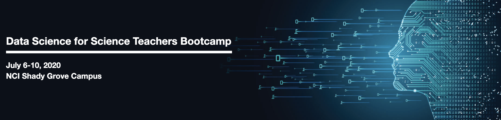

## Monday 6th

12:00-12:50- Introduction to bootcamp and goals 

1:00-1:50 – Introduction to data science by [Dr. Susan Gregurick](https://datascience.nih.gov/director)

2:00-2:30 – Introduction to technologies used in this bootcamp

2:30-3:30 - Icebreakers breakout

**Asynchronous**

Data Science examples in:

-Biology/Bioinformatics by [Dr. Miranda Darby](https://www.hood.edu/academics/faculty/miranda-darby)

-Other Videos

## Tuesday 7th

12:00-12:50 - Examples in data science breakout Q & A

1:00-4:00- Galaxy genomics analysis hands-on (Dr. Allissa Dillman, TA: Dr. Amy Stonelake)

**Asynchronous**

-Data Sources:Exploring publicly available data by Dr. Lisa Federer NLM

-Other work problems in R

## Wednesday 8th

12:00-12:50 - Live presenter

1:00-4:00 – Hands on R (Dr. Allissa Dillman, TA: Dr. Wynn Meyer )

**Asynchronous**

-Introduction to statstics by [Dr. Jeff Leek](http://jtleek.com/index.html)

-Introduction to ML/AI (Sara Ranjbar or Marrtin)

-Legal and ethics around ML/AI by Emma Jardas

## Thursday 9th

12:00-12:50 – Stats, ML/AI, ethics panel 

1:00-4:00 – Hands on R (Allissa, TA Wyn)

**Asynchronous**

Presentations from the [SEPA program](https://nihsepa.org/) project leaders 

-[Teaching the Genome Generation](https://youtu.be/ce4nBjAfKKU) by Dr.Charlie Wray

-[Informatics and Data Science Projects at HudsonAlpha](https://youtu.be/yRDknL8YZm4) by Dr. Neil Lamb and team 

-[Dr.Jane Disney]()

Citizen science highlights (Mini-dream high school DS challenge) by Dr.Jennifer Couch

## Friday 10th
12:00-12:50 – SEPA and Citizen science breakouts

1:00-1:50 - Resources and programs for their students (Kristen (HISTEP),Darryl (UGSP), Yewon SIP)

2:00-2:50 – Bootcamp: Group Discussion, what did we learn?

3:00-4:00 – Meeting outcomes: Future opportunities, collaborations handing over slack channel and discussion of adding resources to github.
